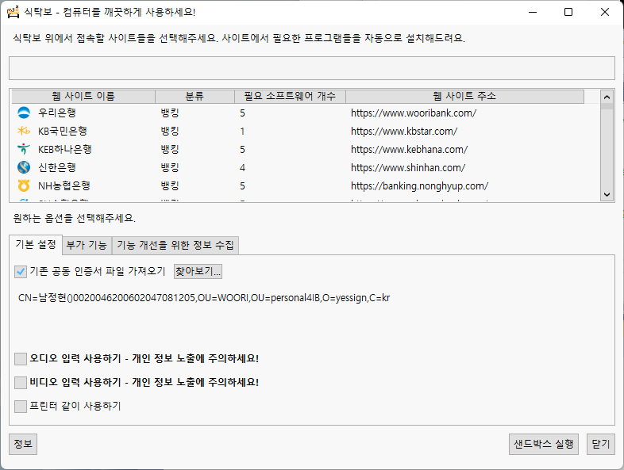
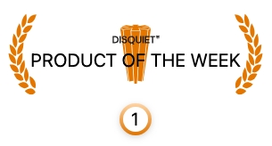

# TableCloth - Use Your Computer Safely

> Notice: Due to inflation and changes in Authenticode acceptance policies, the cost of renewing Authenticode certificates has become too high and we are unable to apply Codesign certificates to our application binaries. SmartScreen warnings may appear, or TableCloth may be automatically terminated or removed by running antivirus software. Please keep this in mind when using the application.

> Notice: Due to a change in Microsoft Store policy, it has become difficult to update to the latest version of TableCloth. Please uninstall the Microsoft Store version of the TableCloth app and reinstall the version we release on GitHub to ensure you have access to the latest features.

> Notice: With the release of version 1.13.0, the TableCloth project has changed to a dual license model. You can choose between AGPL 3.0 or a commercial license. If you use the commercial license, please contact us at the contact details in the license file.

* [Korean (한국어) Readme](README.md)
* [English Readme](README.EN.md)

## Summary

This project is a program that takes advantage of the Windows Sandbox, which was added in Windows 10 version 1909, to help you use various client security programs that are installed when you use Korean Internet banking or Korean eGovernment Internet services on your computer without affecting the actual computer environment.

In Korea, there are many agents, virtual keyboards, and intermediate encryption programs that are installed in the name of security. However, in the ever-changing web ecosystem, there are still many websites that don't properly reflect the requirements of the Windows operating system. As a result, the ancillary software that is supposed to provide security and stability can actually slow down your system's performance and sometimes even break the Windows operating system.

This project helps mitigate this problem and keep your computer sound and safe at all times.

## Installation

To easily install and use TableCloth, we recommend installing via UniGetUI or Winget.

1. Install Windows 11 Pro, Education, or Enterprise SKU or higher.

2. Enable the Windows Sandbox option.

3. Install the latest version of UniGetUI from <https://apps.microsoft.com/detail/XPFFTQ032PTPHF?hl=ko&gl=KR&ocid=pdpshare>.

4. Install the latest version of the TableCloth package from <https://marticliment.com/unigetui/share/?name=TableCloth&id=TableClothProject.TableCloth&sourceName=winget&managerName=WinGet>.

If you are familiar with using the winget command line, you can install it as follows.

## Guide to Updating Website Information

If you encounter issues related to specific websites accessible via TableCloth, please report or contribute using one of the following methods:

* **Recommended**: [Open an issue or submit a PR to the TableCloth Catalog repository](https://github.com/yourtablecloth/TableClothCatalog)
* [Report via Google Forms](https://forms.gle/Pw6pBKhqF1e5Nesw6)
* [Report/Discuss via the Discord channel](https://discord.gg/eT2UnUXyTV)

## Build Environment

* Visual Studio 2026 or later
* .NET 10.0 SDK
* .NET Framework 4.8 SDK

## Test Environment

* Windows 11 25H2 or later
* Supported SKU: Pro, Edu, and Enterprise
* Windows Sandbox activated

## [Developer Guide](./DEVREADME.md)

## Sponsors

Continuous support through GitHub Sponsorship will greatly help us continue the project. [Sponsor the Project](https://github.com/sponsors/yourtablecloth)

## Awards

### September 2024

## Legal Notices

### Copyright

**TableCloth** software is a copyrighted work protected under Korean copyright law.

* **Copyright Registration Number**: C-2025-051228
* **Registration Date**: November 21, 2025
* **Copyright Holder**: rkttu.com
* **Inquiry**: Search by registration number on the [Korea Copyright Commission CROS Portal](https://www.cros.or.kr)

© 2021-2026 rkttu.com. All rights reserved.

### Trademark

The name **'TableCloth'** is a registered trademark filed with the Korean Intellectual Property Office.

* **Application Number**: 4020240205929
* **Application Announcement Date**: March 17, 2025
* **Trademark Holder**: rkttu.com
* **Inquiry**: Search by application number on [KIPRIS (Korea Intellectual Property Rights Information Service)](https://www.kipris.or.kr)

Commercial use of the name 'TableCloth' requires the permission of the trademark holder.

### License

This project adopts a **dual license** model:

1. **AGPL 3.0**: For open-source projects and non-commercial use
2. **Commercial License**: For commercial use, please contact us separately

For more details, refer to the [LICENSE-AGPL](./LICENSE-AGPL) file.

## Image Copyright Information

 by [Icons8](https://img.icons8.com/color/96/000000/tablecloth.png)

 by [Freepik Flaticon](https://www.flaticon.com/free-icon/spork_5625701)

 by [Freepik photo3idea_studio](https://www.flaticon.com/free-icons/sponge)
