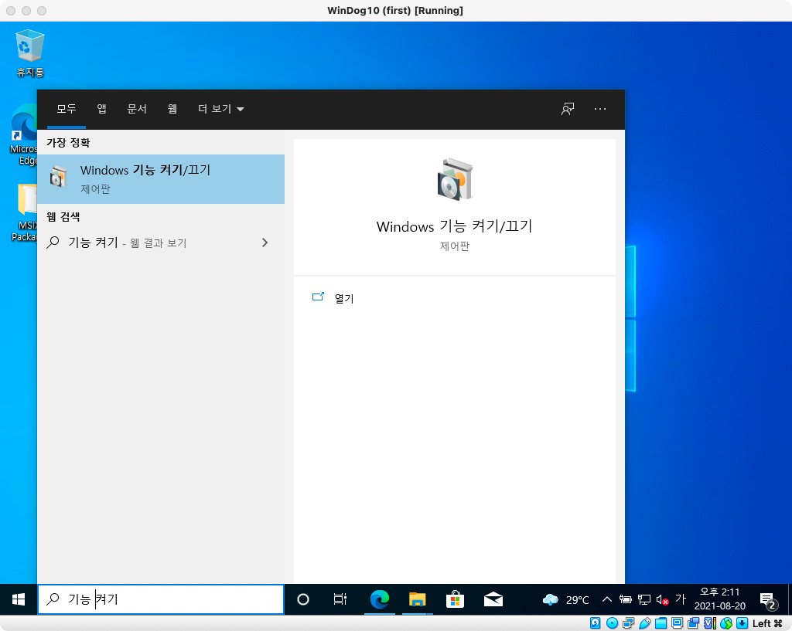
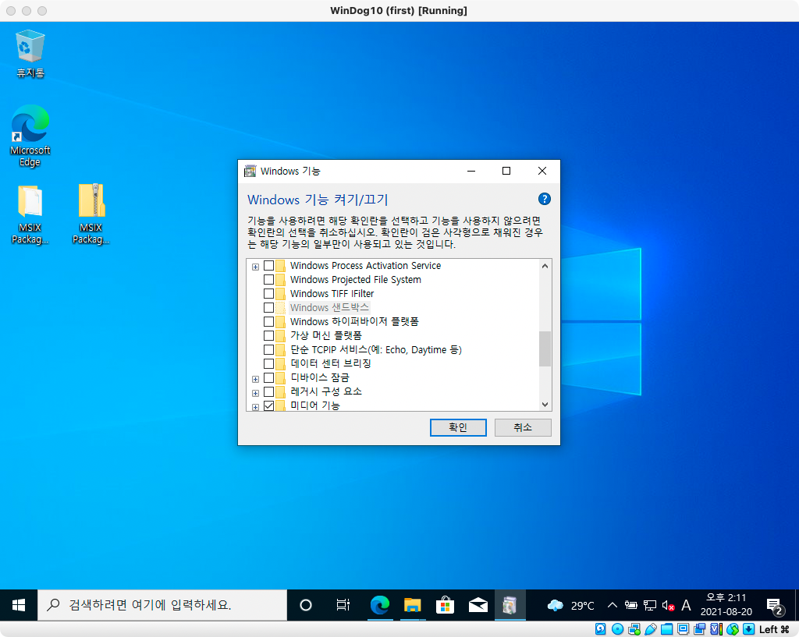
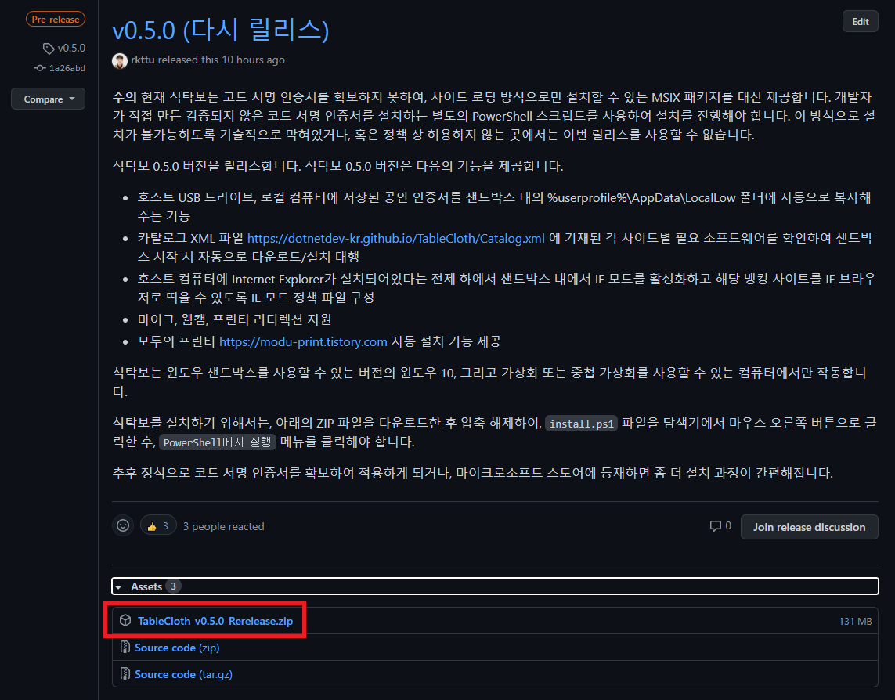
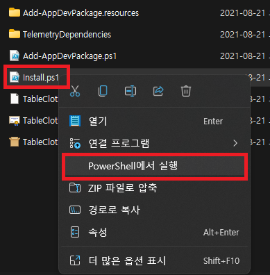
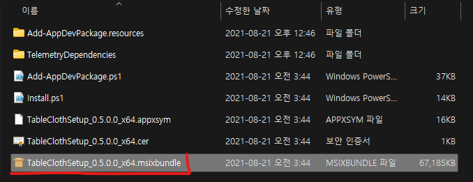

# 식탁보 (Table Cloth) 프로젝트

 

## 개요

이 프로젝트는 윈도우 10 버전 1909부터 추가된 윈도우 샌드박스를 활용하여, 컴퓨터에서 인터넷 뱅킹을 사용하거나, 전자정부 인터넷 서비스를 사용할 때 설치되는 여러가지 클라이언트 보안 프로그램을 실제 컴퓨터 환경에 영향을 주지 않고 사용할 수 있도록 도와주는 프로그램입니다.

보안을 명목으로 설치되는 여러가지 에이전트, 가상 키보드, 중간 암호화 프로그램들은 그 나름대로의 의미가 있습니다. 하지만 계속해서 변화하는 웹 생태계, 윈도우 운영 체제의 요구 사항을 제대로 반영하지 못하는 웹 사이트가 여전히 많습니다. 그로 인해 보안과 안정성을 추구해야 할 보조 소프트웨어들이 오히려 시스템의 성능을 저하시키거나 때로는 윈도우 운영 체제를 파괴하는 일도 발생합니다.

이런 문제를 완화하고, 컴퓨터를 항상 안정적인 상태로 유지할 수 있도록 도와주기 위하여 이 프로젝트를 시작하게 되었습니다.

## 사용 방법

현재 식탁보는 정식 코드 서명 인증서를 적용할 수 없습니다. (정식 코드 서명 인증서는 국내외 모두 사업자 인증 및 사업 거점 인증이 필요합니다.)

따라서 사이드 로딩 방식으로만 설치할 수 있는 MSIX 패키지를 대신 제공합니다. 개발자가 직접 만든 검증되지 않은 코드 서명 인증서를 설치하는 별도의 PowerShell 스크립트를 사용하여 설치를 진행해야 합니다. 이 방식으로 설치가 불가능하도록 기술적으로 막혀있거나, 혹은 정책 상 허용하지 않는 곳에서는 이번 릴리스를 사용할 수 없습니다.

최신 버전은 [이곳](https://github.com/yourtablecloth/TableCloth/releases)에서 다운로드할 수 있습니다.

### 윈도우 샌드박스를 활성화하는 방법

식탁보를 설치하기 전, 먼저 윈도우 샌드박스를 활성화해야 합니다.

- "Windows 기능 켜기/끄기" 어플리케이션을 실행합니다.

  

- "Windows 샌드박스" 기능을 겹니다.

  

### 프로그램 설치하기

2021년 8월 20일 현재 사이드로딩 방식으로 설치하는 방법을 설명합니다. 추후 변경될 가능성이 있습니다.

- [릴리스 페이지](https://github.com/yourtablecloth/TableCloth/releases)에서 원하는 버전을 찾아 다운로드합니다. Pre-release 버전을 제외하고 보통 가장 먼저 등장하는 버전이 최신 버전입니다.

  

- (처음 설치하시는 경우) 파일을 다운로드한 후, ZIP 파일의 압축을 풀고, 폴더 안의 `install.ps1` 파일을 찾아 마우스 오른쪽 버튼을 클릭하고, PowerShell에서 실행하기 메뉴를 클릭합니다. 스크립트가 끝까지 실행되면 자동으로 앱까지 설치가 마무리됩니다.

  

- (이미 한 번 이상 설치하신 경우) 파일을 다운로드한 후, ZIP 파일의 압축을 풀고, 폴더 안의 `.msixbundle` 파일을 더블 클릭합니다. 만약 설치가 안될 경우, 기존 앱을 삭제하고 다시 설치를 시도합니다.

  

## 기여 방법

이 프로그램은 카탈로그 파일을 통해 각 인터넷 뱅킹 및 전자 정부 사이트에 접속할 때 설치해야 할 소프트웨어들을 자동으로 찾아 다운로드받습니다.

이 때 프로그램을 직접 다운로드받을 수 있는 URL이 바뀌거나, 구 버전으로 다운로드되는 경우가 있을 수 있는데, 이 부분에 대한 컨트리뷰터 여러분의 기여가 필요합니다.

만약 주소가 바뀌었다면 [Catalog 리포지터리](https://github.com/yourtablecloth/TableClothCatalog)에서 `Catalog.xml` 파일에 대한 풀 리퀘스트를 보내주세요.

## 라이선스

본 프로젝트는 MIT 라이선스를 따릅니다.

Project emblem made by [Eucalyp](https://www.flaticon.com/authors/eucalyp) from [Flaticon](https://www.flaticon.com/).

Photo by [Brooke Lark](https://unsplash.com/@brookelark?utm_source=unsplash&utm_medium=referral&utm_content=creditCopyText) on [Unsplash](https://unsplash.com/s/photos/tablecloth?utm_source=unsplash&utm_medium=referral&utm_content=creditCopyText).

## 참고 사항

식탁보는 기본적으로 윈도우 샌드박스를 사용하여 구동하므로, 별도의 가상 컴퓨터 설치가 필요하지 않습니다.

그러나 윈도우 365, 혹은 윈도우 가상 데스크톱 (마이크로소프트 애저 기반), 혹은 버추얼 어플라이언스 상에서 식탁보를 추가로 이용하고자 할 경우, 해당 서비스 또는 가상 컴퓨터 인스턴스 내에서 추가로 가상화 (혹은 SLAT) 기능을 지원해야만 윈도우 샌드박스를 활성화할 수 있습니다.

인텔 맥 기반에서는 기술적으로 중첩 가상화를 사용할 수 있는 VM웨어 퓨전, 패러렐즈 같은 가상화 소프트웨어가 존재하지만, 성능에 문제가 있어 추천하지 않으며, 대신 부트캠프 상에서 식탁보를 사용하는 것을 권장합니다.

애플 실리콘 기반의 맥에서는 식탁보가 필요로 하는 윈도우 샌드박스가 ARM 프로세서용으로 출시되지 않아 사용할 수 없습니다.
