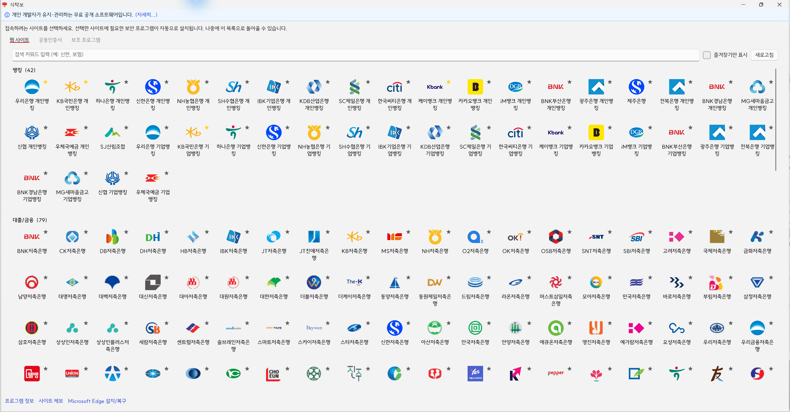
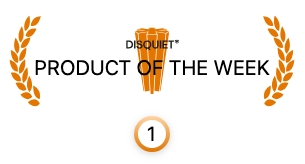

# 식탁보 TableCloth

Windows Sandbox에서 인터넷 뱅킹과 전자정부 사이트를 사용할 때 필요한 보안 프로그램을 격리하여 실행합니다.

[](https://github.com/yourtablecloth/TableCloth/actions)
[](https://discord.gg/eT2UnUXyTV)
[](https://github.com/sponsors/yourtablecloth)
[](https://github.com/yourtablecloth/TableCloth/releases)
[](https://marticliment.com/unigetui/share?name=TableCloth&id=TableClothProject.TableCloth&sourceName=winget&managerName=WinGet)

> [!IMPORTANT]
> 2026년 1월 17일부터 Certum 코드 서명 인증서를 사용합니다. v1.14.0 이후 GitHub Release의 실행 파일에는 Authenticode 서명을 적용합니다.

> [!IMPORTANT]
> Microsoft Store 정책 변경으로 Store 버전의 최신 업데이트를 제공하기 어렵습니다. Store 버전을 제거한 뒤 [GitHub Releases](https://github.com/yourtablecloth/TableCloth/releases) 또는 WinGet 패키지로 다시 설치하면 현재 릴리스를 사용할 수 있습니다.

> [!IMPORTANT]
> v1.13.0부터 AGPL-3.0과 상용 라이선스를 함께 제공합니다. 적용할 라이선스는 [라이선스 안내](#라이선스)를 기준으로 판단할 수 있습니다.

> [!CAUTION]
> **사칭과 피싱에 주의하십시오.**
>
> 식탁보는 본인 인증, 회원 가입, 카드 결제 또는 금전을 요구하지 않습니다. 공식 배포처는 [GitHub Releases](https://github.com/yourtablecloth/TableCloth/releases)와 WinGet 패키지 `TableClothProject.TableCloth`입니다. 검색 광고에서 제공하는 다운로드 파일은 공식 배포본으로 간주하지 않습니다.



## 프로젝트 개요

식탁보는 호스트 Windows에서 Windows Sandbox를 시작하고 필요한 폴더와 설정만 게스트에 전달합니다. 샌드박스 안에서는 Spork가 사이트 카탈로그를 표시하고 선택한 사이트에 필요한 보안 프로그램을 설치합니다. 샌드박스를 닫으면 게스트에 설치한 프로그램과 변경 사항이 함께 폐기됩니다.

v1.21.0은 WPF UI를 Avalonia로 이관하고 TableCloth와 Spork 배포본을 Native AOT로 전환했습니다. 현재 정식 버전인 [v1.21.1](https://github.com/yourtablecloth/TableCloth/releases/tag/v1.21.1)은 첫 실행 데이터 디렉터리 처리 문제인 [#308](https://github.com/yourtablecloth/TableCloth/issues/308)을 수정한 긴급 업데이트입니다.

## 식탁보 AI Preview

빠른 시작 화면에서 `식탁보 AI (Preview)`를 열 수 있습니다. 이 기능은 TableCloth 전용 위치에 OpenAI Codex 런타임을 설치하고 사용자의 ChatGPT 로그인으로 대화를 처리합니다. 선택한 모델은 기존 애플리케이션 설정에 저장합니다. 응답의 웹 링크를 누르면 Windows Sandbox 또는 현재 Windows 브라우저를 선택할 수 있습니다. Sandbox 경로는 TableCloth Catalog를 확인하고 Spork로 필요한 소프트웨어를 설치한 뒤 페이지를 엽니다.

일반 설정 창의 `AI 스킬` 탭에서 전용 Codex 스킬을 조회하고 추가, 활성화, 비활성화, 제거할 수 있습니다. AI 대화 창에도 활성 스킬 수를 표시하고 스킬 관리 기능을 제공합니다. TableCloth는 전용 프로필 밖에서 Codex가 찾은 사용자 및 프로젝트 스킬을 대화 실행 전에 끕니다. 스킬 파일과 사용 설정은 Codex 런타임 릴리스 폴더와 분리하므로 런타임 업데이트나 재설치 후에도 유지합니다.

내장 `tablecloth-certificate-expiry` 스킬은 공동인증서 만료일 질문을 처리합니다. 사용자가 동의하면 호스트의 `TableClothCli.exe`가 기본 NPKI 폴더에서 인증서 공개 정보와 로컬 Catalog 캐시 현황을 조회합니다. 대화에는 인증서 이름, 경로와 개인키를 제외한 결과만 전달합니다. CLI는 인증서와 특정 Catalog 서비스의 관계를 추정하지 않습니다.

AI Preview 메시지를 전송하면 사용자의 OpenAI 구독 사용량을 소비합니다. 기능의 구현 상태, 보안 경계와 아직 실행하지 않은 실기기 검증은 [AI Preview 구현 및 검증 보고서](docs/poc/managed-ai-runtime.md)에 기록했습니다. [최초 PoC 설계](docs/poc/managed-ai-runtime-design.ko.md)는 구현 전 기준과 의사결정 이력을 보존합니다.

정식 릴리스는 다음 네 가지 앱 조합을 제공합니다.

- TableCloth x64와 ARM64
- Spork x64와 ARM64
- 설치 관리자와 Portable ZIP
- Authenticode 서명과 아키텍처별 SBOM

## 지원 환경

- Windows 11 Pro, Education 또는 Enterprise
- Windows Sandbox 기능
- x64 또는 ARM64 프로세서
- 인터넷 연결

Windows Sandbox를 제공하지 않는 Windows Home은 현재 지원 대상에 포함하지 않습니다. 조직에서 Windows Sandbox, 가상화 또는 GitHub 다운로드를 차단했다면 시스템 관리자 정책이 우선합니다.

## 설치와 실행

WinGet을 사용할 수 있다면 다음 명령으로 설치합니다.

```powershell
winget install --exact --id TableClothProject.TableCloth
```

WinGet 등록소 반영에는 GitHub Release 게시 이후 시간이 더 걸릴 수 있습니다. WinGet에서 최신 버전을 찾지 못하면 [GitHub Releases](https://github.com/yourtablecloth/TableCloth/releases)에서 아키텍처에 맞는 설치 관리자를 내려받을 수 있습니다. GUI 패키지 관리가 편하다면 [UniGetUI 공유 링크](https://marticliment.com/unigetui/share/?name=TableCloth&id=TableClothProject.TableCloth&sourceName=winget&managerName=WinGet)를 사용할 수 있습니다.

설치 후 TableCloth에서 공유할 데이터와 장치 옵션을 선택하고 `샌드박스 시작`을 누릅니다. 사이트 선택과 보안 프로그램 설치는 Windows Sandbox 안의 Spork에서 진행합니다.

## 무설치 Express 실행

호스트에 TableCloth를 설치하지 않고 Windows Sandbox 안에서 Spork만 실행할 수도 있습니다.

1. 최신 정식 릴리스에서 [`no-install-spork.wsb`](https://github.com/yourtablecloth/TableCloth/releases/latest/download/no-install-spork.wsb)를 내려받습니다.
2. 내려받은 파일을 두 번 눌러 Windows Sandbox를 시작합니다.
3. SporkBootstrap이 현재 아키텍처에 맞는 최신 Spork Portable 패키지를 검증하고 실행할 때까지 기다립니다.

무설치 구성은 호스트 폴더를 게스트에 매핑하지 않습니다. 따라서 호스트의 파일 기반 공동인증서와 데이터 폴더를 사용할 수 없습니다. 모바일 인증처럼 호스트 파일을 요구하지 않는 인증 수단에 적합합니다.

설계와 자산 계약은 [무설치 부트스트래퍼 설계](docs/EXPRESS_BOOTSTRAPPER_DESIGN.md)와 [파라미터화된 WSB 스펙](docs/PARAMETERIZED_WSB_SPEC.md)에 기록했습니다. 이름 해석에 실패한 경우에만 공용 DNS로 전환하며 정상 동작하는 사내 DNS는 유지합니다. 관련 배경은 [#285](https://github.com/yourtablecloth/TableCloth/issues/285)에서 확인할 수 있습니다.

## 사이트 정보 수정과 문제 제보

사이트 카탈로그 수정은 [TableClothCatalog 저장소](https://github.com/yourtablecloth/TableClothCatalog)에 이슈 또는 Pull Request로 제출할 수 있습니다. 다음 채널도 운영합니다.

- [GitHub Issues](https://github.com/yourtablecloth/TableCloth/issues)
- [Google Forms 제보](https://forms.gle/Pw6pBKhqF1e5Nesw6)
- [TableCloth Discord](https://discord.gg/eT2UnUXyTV)

## 개발 문서

- [개발 환경과 프로젝트 구조](DEVELOPMENT.md)
- [브랜치와 버전 관리 정책](docs/BRANCHING.md)
- [Retail과 Preview 릴리스 채널](docs/RELEASE_CHANNELS.md)
- [릴리스 실행 절차](docs/RELEASING.md)
- [업데이트 채널 문제 해결](docs/TROUBLESHOOTING_UPDATE_CHANNEL.md)
- [Avalonia와 Native AOT 전환 기록](docs/AVALONIA_AOT_MIGRATION.md)
- [식탁보 AI Preview 구현 및 검증](docs/poc/managed-ai-runtime.md)

기본 개발 환경은 Visual Studio 2026과 .NET 10 SDK입니다. Native AOT 게시에는 MSVC C++ 빌드 도구가 필요하며 ARM64를 로컬에서 게시하려면 ARM64용 C++ 빌드 도구도 설치해야 합니다. CI는 x64와 ARM64 네이티브 Windows 러너에서 각 아키텍처를 빌드합니다.

## 후원과 수상

[GitHub Sponsors](https://github.com/sponsors/yourtablecloth)를 통해 프로젝트를 후원할 수 있습니다.

2024년 9월에 disquiet.io의 Product of the Week로 선정되었습니다.

[](https://disquiet.io/product/%EC%8B%9D%ED%83%81%EB%B3%B4)

## 법적 고지

### 저작권

식탁보 소프트웨어는 대한민국 저작권법에 따라 보호받습니다.

- 저작권 등록번호 `C-2025-051228`
- 등록일 2025년 11월 21일
- 저작권자 남정현
- [한국저작권위원회 CROS](https://www.cros.or.kr)에서 등록번호로 조회

Copyright 2021-2026 rkttu.com. All rights reserved.

### 상표

`식탁보` 명칭은 대한민국 특허청에 상표로 출원되어 있습니다.

- 출원번호 `4020240205929`
- 출원공고일 2025년 3월 17일
- 출원인 rkttu.com
- [KIPRIS](https://www.kipris.or.kr)에서 출원번호로 조회

### 라이선스

이 저장소는 AGPL-3.0과 상용 라이선스를 함께 제공합니다. AGPL-3.0 조건을 적용하는 경우 [LICENSE-AGPL](LICENSE-AGPL)을 따릅니다. 별도 상용 라이선스는 라이선스 파일에 기재된 연락처로 문의할 수 있습니다.

## 이미지 저작권

- TableCloth Logo by [Icons8](https://img.icons8.com/color/96/000000/tablecloth.png)
- Spork New Logo by [Freepik Flaticon](https://www.flaticon.com/free-icon/spork_5625701)
